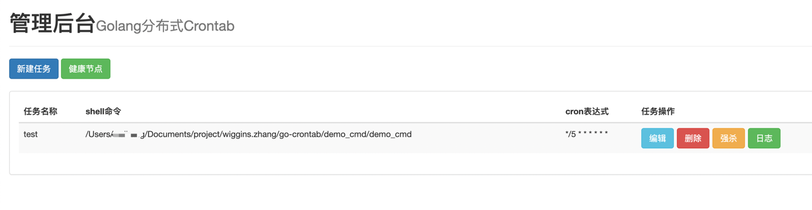
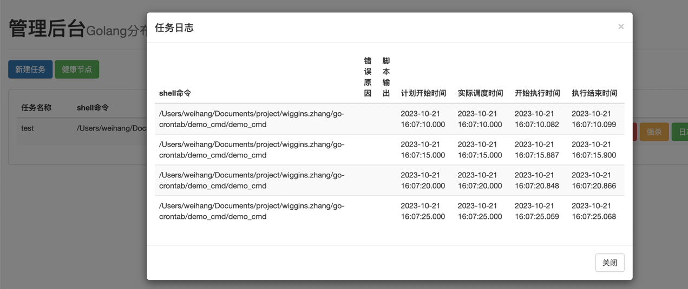

# Golang分布式Crontab  任务调度器

核心实现逻辑：
* cmd/master 简单页面， 
  * 将需要执行的cmd 命令 curd 到etcd中
  * 增加强杀/删除/编辑/查看日志功能
* cmd/worker 调度任务
  * 捕获cmd执行的输出 / 具体例子可以看prepare/cmd_usage
  ```go
  cmd := exec.CommandContext(ctx, "bash", "-c", "sleep 2;echo hello;")
  
    // 执行任务, 捕获输出
    output, err = cmd.CombinedOutput()
  
    // 把任务输出结果, 传给main协程
    resultChan <- &result{
        err:    err,
        output: output,
    }
  ```
  * 计算任务下次执行时间
  ```go
  package main
  
  import (
  "fmt"
  "time"
  
      "github.com/gorhill/cronexpr"
  )
  
  // 代表一个任务
  type CronJob struct {
  expr     *cronexpr.Expression
  nextTime time.Time // expr.Next(now)
  }
  
  func main() {
  // 需要有1个调度协程, 它定时检查所有的Cron任务, 谁过期了就执行谁
  
      var (
          cronJob       *CronJob
          expr          *cronexpr.Expression
          now           time.Time
          scheduleTable map[string]*CronJob // key: 任务的名字,
      )
  
      scheduleTable = make(map[string]*CronJob)
  
      // 当前时间
      now = time.Now()
  
      // 1, 我们定义2个cronjob
      expr = cronexpr.MustParse("*/5 * * * * * *")
      cronJob = &CronJob{
          expr:     expr,
          nextTime: expr.Next(now),
      }
      // 任务注册到调度表
      scheduleTable["job1"] = cronJob
  
      expr = cronexpr.MustParse("*/5 * * * * * *")
      cronJob = &CronJob{
          expr:     expr,
          nextTime: expr.Next(now),
      }
      // 任务注册到调度表
      scheduleTable["job2"] = cronJob
  
      // 启动一个调度协程
      go func() {
          var (
              jobName string
              cronJob *CronJob
              now     time.Time
          )
          // 定时检查一下任务调度表
          for {
              now = time.Now()
  
              for jobName, cronJob = range scheduleTable {
                  // 判断是否过期
                  if cronJob.nextTime.Before(now) || cronJob.nextTime.Equal(now) {
                      // 启动一个协程, 执行这个任务
                      go func(jobName string) {
                          fmt.Println("执行:", jobName)
                      }(jobName)
  
                      // 计算下一次调度时间
                      cronJob.nextTime = cronJob.expr.Next(now)
                      fmt.Println(jobName, "下次执行时间:", cronJob.nextTime)
                  }
              }
  
              // 睡眠100毫秒
              select {
              case <-time.NewTimer(100 * time.Millisecond).C: // 将在100毫秒可读，返回
              }
          }
      }()
  
      time.Sleep(100 * time.Second)
  }
  
  ```
  
## 使用

### docker 安装 依赖 mysql + etcd
`
docker-compose up -d
`

### 启动master && worker
```bash
cd cmd/master
go run -v main.go
cd ../worker
go run -v main.go
```


### 编译测试定时任务脚本
```sybase
cd demo_cmd
go build
```
demo_cmd 则是往当前路径创建test.txt文件，并往里面写入时间

### 访问master http服务
http://127.0.0.1:8899/

新建任务

任务名称：

test

shell命令：

/Users/xxxx/Documents/project/wiggins.zhang/go-crontab/demo_cmd/demo_cmd
（编译测试定时任务脚本的绝对路径）

cron表达式：

*/5 * * * * * *





